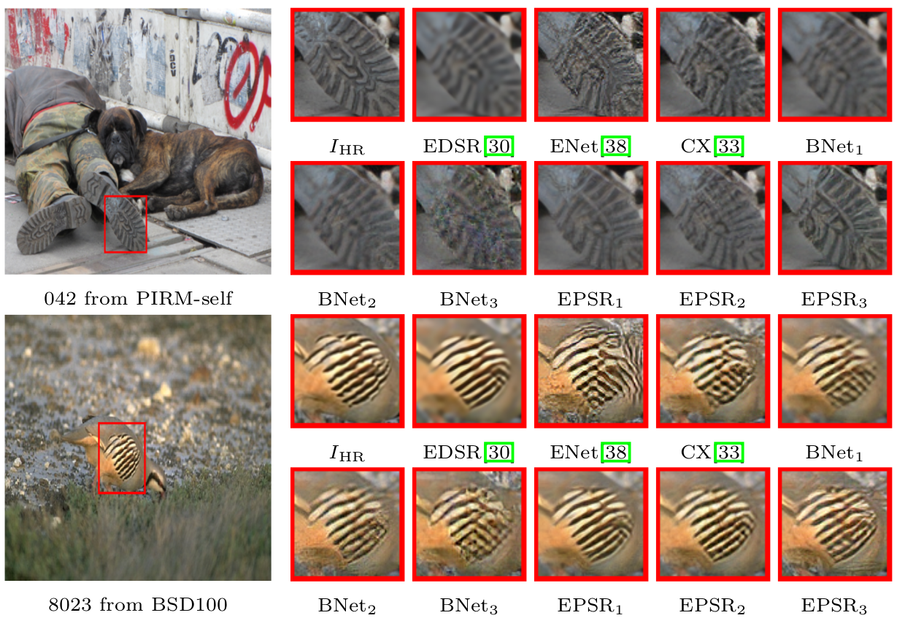
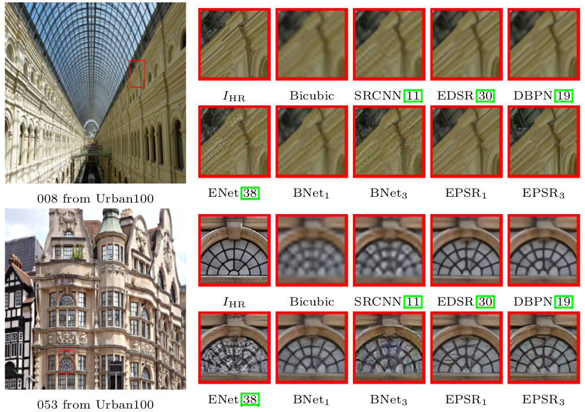
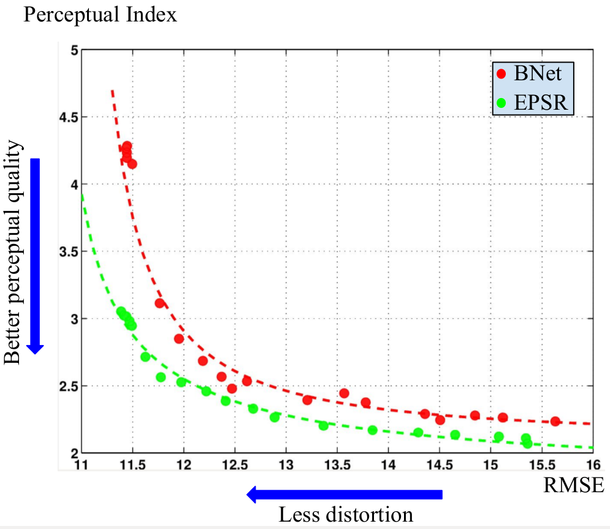
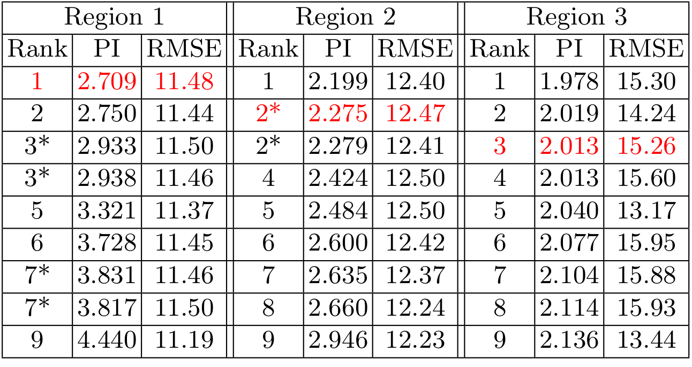

# EPSR (Enhanced Perceptual Super-resolution Network) [paper coming soon]()

This repo provides the test code, pretrained models, and results on benchmark datasets of our work. We (IPCV_team) won the first place in [PIRM2018-SR competition](https://www.pirm2018.org/PIRM-SR.html) (region 1). We were also ranked as second and thrid in region 2 and 3 respectively. For details refer to our recently accepted paper in [ECCV2018 PIRM Workshop](https://pirm2018.org/).

"Analyzing Perception-Distortion Tradeoff using Enhanced Perceptual Super-resolution Network", [Subeesh Vasu](https://subeeshvasu.github.io), [Nimisha T. M.](https://nimiiit.github.io/) and [A. N. Rajagopalan](http://www.ee.iitm.ac.in/~raju/), Perceptual Image Restoration and Manipulation (PIRM) Workshop and Challenge, Eurpean Conference on Computer Vision Workshops (ECCVW 2018), Munich, Germany, September 2018

#### BibTeX
 
     @inproceedings{vasu2018epsr,
        author = {Vasu, Subeesh and T.M., Nimisha and Rajagopalan, A.N.},
        title = {Analyzing Perception-Distortion Tradeoff using Enhanced Perceptual Super-resolution Network},
        booktitle = {European Conference on Computer Vision (ECCV) Workshops},
        year = {2018}}
## Results     

Visual comparison for 4× SR with bicubic interpolation model on PIRM-self, BSD100, and Urban100 datasets. Here IHR refers to the ground truth HR image. [SRCNN](http://mmlab.ie.cuhk.edu.hk/projects/SRCNN.html), [EDSR](http://openaccess.thecvf.com/content_cvpr_2017_workshops/w12/papers/Lim_Enhanced_Deep_Residual_CVPR_2017_paper.pdf), [DBPN](http://openaccess.thecvf.com/content_cvpr_2018/papers/Haris_Deep_Back-Projection_Networks_CVPR_2018_paper.pdf), [ENet](http://openaccess.thecvf.com/content_ICCV_2017/papers/Sajjadi_EnhanceNet_Single_Image_ICCV_2017_paper.pdf), and [CX](https://arxiv.org/pdf/1803.04626.pdf) are existing works. EPSR1, EPSR2, and EPSR3 are the results of our approach (EPSR) corresponding to region 1, 2, and 3 of PIRM-SR challenge. BNet1, BNet2, and BNet3 are the results of our baseline network. 

Perception-distortion trade-off between BNet and EPSR. For both methods, the above plot has the values corresponding to 19 model weights which span different regions on the perception-distortion plane and the corresponding curves that best fit these values.

Performance comparison of top 9 methods from PIRM-SR challenge. Methods are ranked based on the PI and RMSE values corresponding to the test data of PIRM-SR. The entries from our approach are highlighted in red. Methods with a marginal difference in PI and RMSE values share the same rank and are indicated with a " * ".

## Test
The code is built on the official implementation of [EDSR (PyTorch)](https://github.com/thstkdgus35/EDSR-PyTorch) and tested on Ubuntu 16.04 environment (Python3.6, PyTorch_0.4.0, CUDA8.0) with Titan X GPU. Refer [EDSR (PyTorch)](https://github.com/thstkdgus35/EDSR-PyTorch) for other dependencies. Test code of EPSR can be found in [EPSR_testcode](https://github.com/subeeshvasu/2018_subeesh_epsr_eccvw/tree/master/EPSR_testcode).

## Results on public benchmark datasets

- [PIRM-self](https://drive.google.com/file/d/1ottkNHZpSYBk9gMrc1T_iCHdMsQsIKAy/view?usp=sharing)
- [PIRM-test](https://drive.google.com/file/d/1OngQfvbpVXCFDHNZhZMAMGjTSVNAfkOb/view?usp=sharing) 
- [BSD100](https://drive.google.com/file/d/12ABqYLYcIhCuYJkMs4HANarjj-OxzWQ2/view?usp=sharing) 
- [Urban100](https://drive.google.com/file/d/1vgjberya6rYcYq7sTW-DsVOnadqvVYNM/view?usp=sharing) 
- [Set14](https://drive.google.com/file/d/1FxlVy93o8ZbrCKtqYo8hkk5F4Vx9vRA9/view?usp=sharing) 
- [Set5](https://drive.google.com/file/d/1I08xKTumupde5BNTEN_e7kJZTLbQeYnJ/view?usp=sharing)

## References

[SRCNN] Dong, C., Loy, C.C., He, K., Tang, X.: [Learning a deep convolutional network for image super-resolution](http://mmlab.ie.cuhk.edu.hk/projects/SRCNN.html). ECCV 2014

[EDSR] Lim, B., Son, S., Kim, H., Nah, S., Lee, K.M.: [Enhanced deep residual networks for single image super-resolution](http://openaccess.thecvf.com/content_cvpr_2017_workshops/w12/papers/Lim_Enhanced_Deep_Residual_CVPR_2017_paper.pdf). CVPR workshops 2017

[DBPN] Haris, M., Shakhnarovich, G., Ukita, N.: [Deep backprojection networks for super-resolution](http://openaccess.thecvf.com/content_cvpr_2018/papers/Haris_Deep_Back-Projection_Networks_CVPR_2018_paper.pdf). CVPR 2018

[ENet] Sajjadi, M.S., Sch ̈olkopf, B., Hirsch, M.: [Enhancenet: Single image super-resolution through automated texture synthesis](http://openaccess.thecvf.com/content_ICCV_2017/papers/Sajjadi_EnhanceNet_Single_Image_ICCV_2017_paper.pdf). ICCV 2017

[CX] Mechrez, R., Talmi, I., Shama, F., Zelnik-Manor, L. [Learning to maintain natural image statistics](https://arxiv.org/pdf/1803.04626.pdf). arXiv preprint arXiv:1803.04626 (2018)

## Acknowledgements
This code is built on [EDSR (PyTorch)](https://github.com/thstkdgus35/EDSR-PyTorch). We thank the authors for sharing their codes of EDSR [PyTorch version](https://github.com/thstkdgus35/EDSR-PyTorch).

